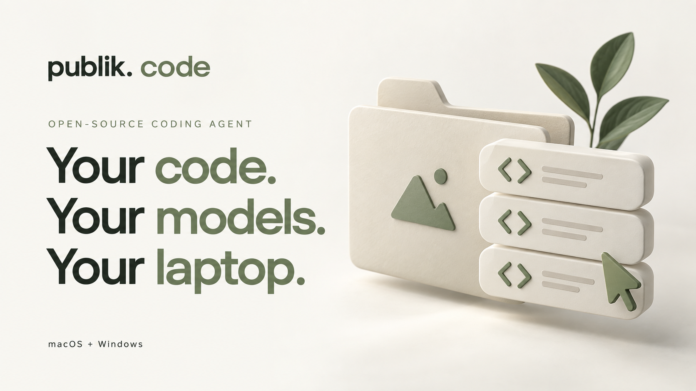
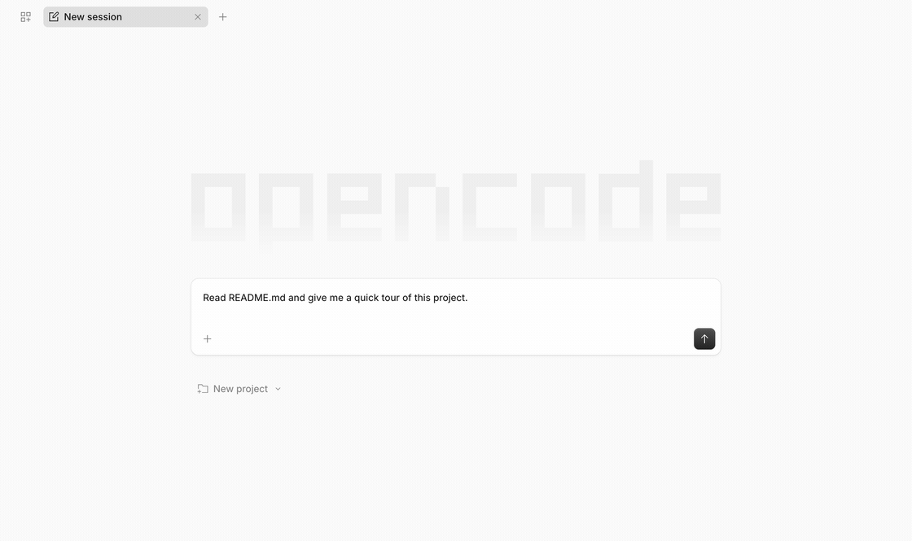
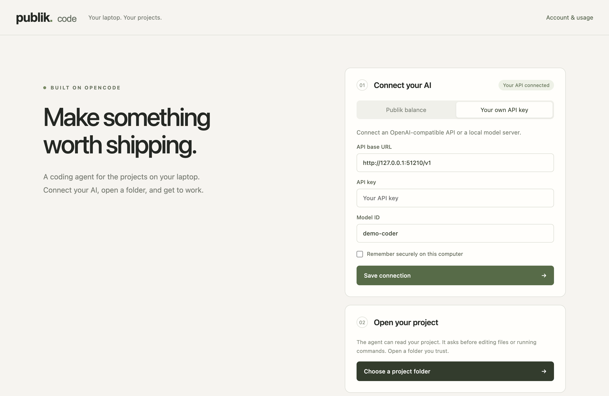
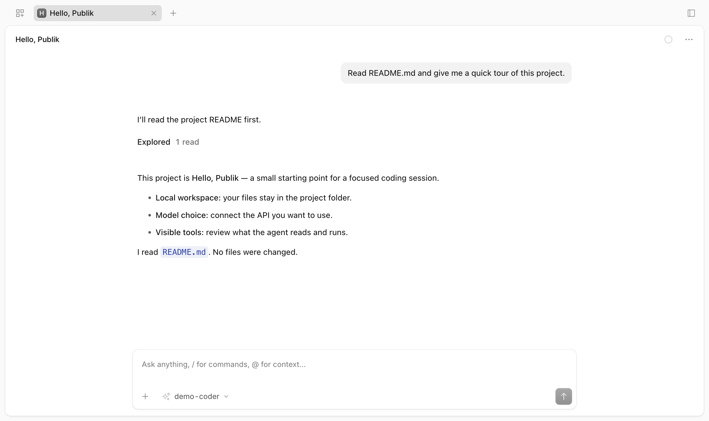

<p align="center">
  
</p>

<p align="center">
  <strong>An open-source coding workspace for the projects on your laptop.</strong><br>
  Choose a model provider. Open a folder. Make something worth shipping.
</p>

<p align="center">
  <a href="https://publikhq.com/publik-code"></a>
  <a href="#get-started"></a>
  <a href="LICENSE"></a>
</p>

<p align="center">
  <a href="#see-it-in-action"><strong>Watch the demo</strong></a> ·
  <a href="#get-started"><strong>Get started</strong></a> ·
  <a href="docs/DEVELOPMENT.md"><strong>Developer guide</strong></a> ·
  <a href="https://publikhq.com/publik-code"><strong>View on Publik ↗</strong></a>
</p>

> **Developer preview:** connect your own OpenAI-compatible API today. Publik account linking is implemented, but its app-token setup and live verification are still pending. [Current validation status →](VALIDATION.md)

## See it in action

<p align="center">
  
</p>

<p align="center"><sub>Recorded in the real desktop app with a deterministic local mock provider. The engine reads a real demo file; this is not a live Publik model call. <a href="docs/media/coding-session.png">View the still image</a>.</sub></p>

## A familiar workflow, with your choice of models

| Work on your laptop | Choose how you connect | Stay in control |
|:---|:---|:---|
| Open a local project and keep your sessions on your computer. | Bring an OpenAI-compatible API, or use the Publik connection once setup is complete. | Inspect tool activity and approve edits and commands before they run. |

Publik Code pairs a small desktop launcher with **OpenCode’s existing coding engine and interface**. File tools, streaming responses, conversations, and the working session come from OpenCode. Our layer handles the desktop window, provider setup, project selection, and Publik balance/error integration.

### From project to progress

1. **Connect your AI.** Add your own API base URL, key, and model ID. Keep the key for this session or save it with OS-backed encryption.
2. **Open a folder.** Select a project you trust. The bundled OpenCode engine starts locally.
3. **Give it a task.** Explore the code, ask for a change, and review the tools the agent wants to run.

Your files are local; prompts and relevant project content go to the provider you select. Tool approvals are a user control, not an operating-system sandbox.

<details>
<summary><strong>Take a closer look at the desktop</strong></summary>

<br>


A calm place to choose your provider and open a project. The screenshot uses a local demonstration server and contains no real API credentials.



The OpenCode workspace, embedded in Publik Code. **Account & usage** takes you back to the launcher without closing the workspace.

</details>

## Get started

You’ll need **Node.js 22.18+** and **Git**. The pinned OpenCode executable is downloaded for your platform; you don’t need to install OpenCode separately.

```sh
git clone https://github.com/VedSoni-dev/publikhqapicodingagent.git
cd publikhqapicodingagent
npm ci
npm start
```

Open **Your own API key**, enter your provider’s OpenAI-compatible endpoint and model, then choose a project folder. For a local model server, use its loopback endpoint.

| Platform | Current status |
|:---|:---|
| **macOS · Apple Silicon** | App and packaged launch tested. DMG and ZIP builds verified locally. |
| **Windows · x64** | Installer cross-built. Interactive Windows testing is still pending; Git for Windows is recommended for Bash tools. |

Builds are currently unsigned, and no GitHub release has been published. [Build your own installer →](docs/DEVELOPMENT.md#development-and-verification)

## Two ways to connect

| | Your own API | Publik balance |
|:---|:---|:---|
| **Setup** | Enter an API base URL, key, and model ID. | Link the computer to your Publik account in your browser. |
| **Models** | Models exposed by your OpenAI-compatible provider. | `publik-fast`, `publik-balanced`, `publik-smart`. |
| **Billing** | Through your chosen provider. | Through your Publik balance. |
| **Availability** | Available in this preview. | Integration implemented; app token and live proof pending. |

A saved own-key connection takes precedence. Stop the workspace before switching providers. The actual upstream key stays in the main process/local credential storage; OpenCode receives a temporary credential for the authenticated local adapter.

## Built with good open-source tools

<table>
<tr>
<td align="center" width="20%"><a href="https://github.com/anomalyco/opencode"><br><strong>OpenCode</strong></a><br><sub>Coding engine & interface</sub></td>
<td align="center" width="20%"><a href="https://www.electronjs.org/"><br><strong>Electron</strong></a><br><sub>Desktop application</sub></td>
<td align="center" width="20%"><a href="https://www.typescriptlang.org/"><br><strong>TypeScript</strong></a><br><sub>Integration layer</sub></td>
<td align="center" width="20%"><a href="https://nodejs.org/"><br><strong>Node.js</strong></a><br><sub>Local runtime tools</sub></td>
<td align="center" width="20%"><a href="https://git-scm.com/"><br><strong>Git</strong></a><br><sub>Your project workflow</sub></td>
</tr>
</table>

## Explore the coding-agent ecosystem

If you’re exploring tools like **Cursor** or **Claude Code**, here are other projects worth knowing. These are reference links, not Publik Code integrations or endorsements.

<table>
<tr>
<td align="center" width="16%"><a href="https://cursor.com/"><br><strong>Cursor</strong></a></td>
<td align="center" width="17%"><a href="https://claude.com/product/claude-code"><br><strong>Claude Code</strong></a></td>
<td align="center" width="17%"><a href="https://github.com/features/copilot"><br><strong>GitHub Copilot</strong></a></td>
<td align="center" width="16%"><a href="https://windsurf.com/"><br><strong>Windsurf</strong></a></td>
<td align="center" width="17%"><a href="https://github.com/google-gemini/gemini-cli"><br><strong>Gemini CLI</strong></a></td>
<td align="center" width="17%"><a href="https://github.com/openai/codex"><br><strong>Codex</strong></a></td>
</tr>
</table>

## For builders

```sh
npm run typecheck       # Check the TypeScript
npm test                # Focused adapter and lifecycle tests
npm run test:smoke      # Real OpenCode + local mock model + actual file tool
npm run test:desktop    # Desktop connection, workspace, and shutdown checks
```

Read the [developer guide](docs/DEVELOPMENT.md) for architecture, credential handling, Publik setup, and packaging. See [validation notes](VALIDATION.md) for what has—and has not—been tested. [Re-record the demo](docs/media/README.md); it never calls a paid model.

## Open source, with attribution

[MIT licensed](LICENSE). Built on [OpenCode](https://github.com/anomalyco/opencode), with gratitude to its maintainers and contributors. Publik Code is an independent project and is not affiliated with the OpenCode team or the other products shown above.

[Third-party notices](THIRD_PARTY_NOTICES.md) · [Brand asset sources](docs/branding/README.md) · [Publik listing](https://publikhq.com/publik-code)
